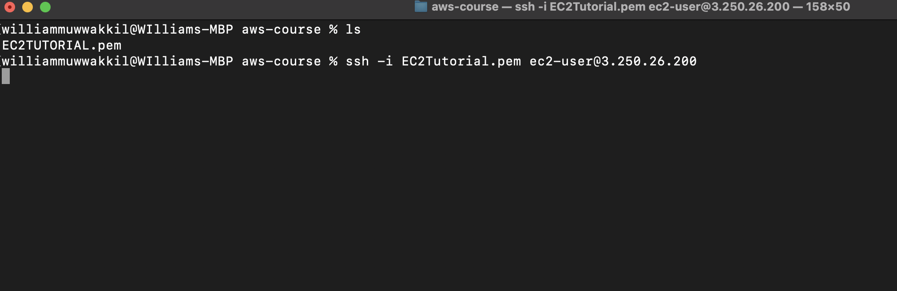
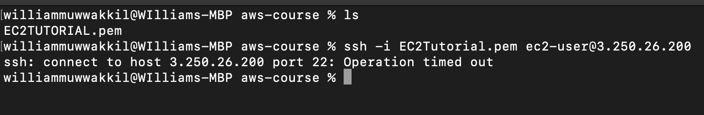
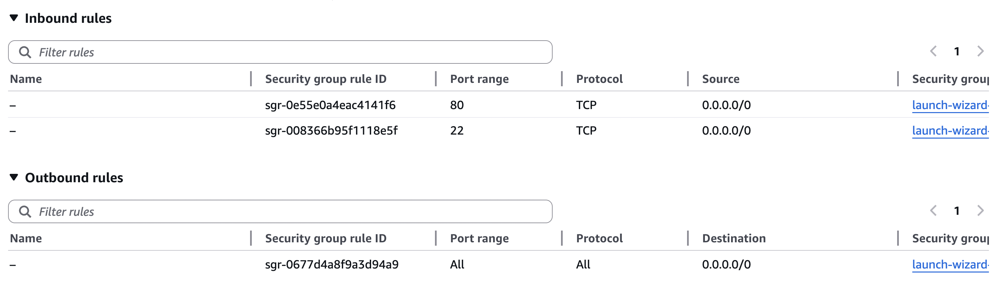
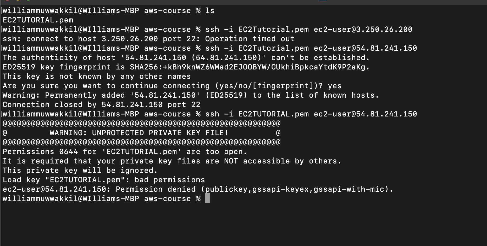

# Lab 01 — SSH Into an EC2 Instance

**Date:** June 10, 2026  
**Environment:** macOS Terminal → Amazon Linux 2023 (EC2)  
**Key Pair:** EC2Tutorial.pem  
**Difficulty:** Beginner  

---

## Objective

Connect to a running EC2 instance from a local machine using SSH and a `.pem` key pair. This lab also covers three real errors encountered during the process and how each one was resolved.

---

## Prerequisites

- An EC2 instance launched and in **Running** state
- A `.pem` key pair downloaded at instance creation time
- Security Group with inbound **SSH (port 22)** allowed
- macOS or Linux terminal (Windows users: use Git Bash or WSL)

---

## Lab Walkthrough

### Step 1 — Locate the .pem Key File

Navigate to the directory containing the key pair file and confirm it's there.

```bash
ls
# Expected output: EC2TUTORIAL.pem (or whatever you named yours)
```



> **Why this matters:** SSH requires the private key file to authenticate. If you can't find it, you can't connect, and AWS won't let you download it again after creation.

---

### Step 2 — First SSH Attempt → ❌ Operation Timed Out

```bash
ssh -i EC2Tutorial.pem ec2-user@3.250.26.200
# Result: ssh: connect to host 3.250.26.200 port 22: Operation timed out
```



**What happened:** The connection hung and eventually timed out. This usually means one of two things:
- The IP address is wrong (stale/old public IP from a previous session)
- Port 22 is blocked in the Security Group

**How it was resolved:** Checked the EC2 console for the correct current public IPv4 address. EC2 instances get a **new public IP every time they stop and start** unless you've assigned an Elastic IP. The original IP `3.250.26.200` was from a previous session.

---

### Step 3 — Verify Security Group Rules

Before retrying, confirmed that the Security Group had SSH (port 22) open.



**What to look for:**
| Rule | Port | Protocol | Source |
|------|------|----------|--------|
| SSH | 22 | TCP | 0.0.0.0/0 |
| HTTP | 80 | TCP | 0.0.0.0/0 |

> **Note:** `0.0.0.0/0` means open to all IPs. Fine for a lab, but in production you'd lock SSH down to your specific IP.

---

### Step 4 — Second SSH Attempt → ❌ Connection Closed

Retried with the new IP `54.81.241.150`:

```bash
ssh -i EC2Tutorial.pem ec2-user@54.81.241.150
# Result: Connection closed by 54.81.241.150 port 22
```


SSH reached the host this time (☺️ the IP and port 22 were correct), but the server immediately closed the connection 😤. The host fingerprint prompt appeared, which was accepted (`yes`), but the session was still dropped.

**What happened:** The `.pem` file had permissions that were too open (`0644`), meaning other users on the system could theoretically read it. SSH refuses to use a key file that isn't locked down — this is a security feature, not a bug.

---

### Step 5 — Third Attempt → ❌ Unprotected Private Key File

Retried again with uppercase filename (`EC2TUTORIAL.pem`): 🤦🏽

```bash
ssh -i EC2TUTORIAL.pem ec2-user@54.81.241.150
```



SSH now showed the full error clearly:

```
WARNING: UNPROTECTED PRIVATE KEY FILE!
Permissions 0644 for 'EC2TUTORIAL.pem' are too open.
It is required that your private key files are NOT accessible by others.
This private key will be ignored.
Load key "EC2TUTORIAL.pem": bad permissions
ec2-user@54.81.241.150: Permission denied (publickey...)
```

**Root cause:** The `.pem` file downloaded from AWS had default permissions of `0644` (readable by owner, group, and others). SSH requires key files to be `0400` (readable by owner only).

**The fix:**

```bash
chmod 400 EC2TUTORIAL.pem
```

`chmod 400` sets the file to read-only for the owner, no access for anyone else. This satisfies SSH's security requirement.

---

### Step 6 — Success ✅

```bash
ssh -i EC2TUTORIAL.pem ec2-user@54.81.241.150
```


Connected. The Amazon Linux 2023 welcome banner appeared and the prompt changed to:

```
[ec2-user@ip-172-31-40-146 ~]$
```

The `172.31.x.x` address is the **private IP** of the instance inside the VPC — that's expected. The public IP (`54.81.241.150`) is how we reached it from the outside; the private IP is how it identifies itself internally.

---

## Errors Encountered & Fixes Summary

| # | Error | Cause | Fix |
|---|-------|-------|-----|
| 1 | `Operation timed out` | Used a stale public IP from a previous session | Grabbed the current public IP from EC2 console |
| 2 | `Connection closed` | `.pem` permissions were too open (`0644`) | Ran `chmod 400` on the key file |
| 3 | `UNPROTECTED PRIVATE KEY FILE` | Same permissions issue, now shown explicitly | Same fix — `chmod 400` resolved it |

---

## Key Concepts Reinforced

**EC2 Public IPs are not static by default.** Every stop/start cycle assigns a new public IP. Use an **Elastic IP** if you need a permanent address.

**SSH key file permissions matter.** The `chmod 400` fix is something every AWS user hits at least once. Now you know why it happens and how to fix it in under 5 seconds.

**Security Groups are stateful.** The inbound rule for port 22 is what allowed SSH traffic through. Without it, the connection would time out regardless of the key file.

**Private IP vs. Public IP.** The prompt showing `172.31.x.x` after login is the instance's private VPC address — totally normal.

---

## Commands Used

```bash
# List files in current directory
ls

# Connect to EC2 instance via SSH
ssh -i EC2Tutorial.pem ec2-user@<PUBLIC_IP>

# Fix key file permissions (run this before SSH if you hit the unprotected key error)
chmod 400 EC2TUTORIAL.pem
```

---

## What's Next

More labs coming — topics will cover core SAA-C03 domains including networking, storage, IAM, and high availability. Stay tuned.
